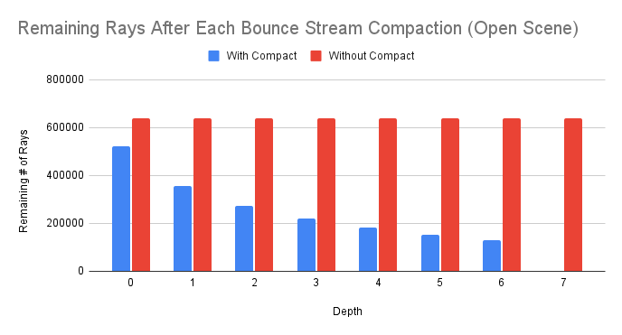

# CUDA Path Tracer

**University of Pennsylvania, CIS 565: GPU Programming and Architecture, Project 3**

  

- Jacqueline Guan
  - [LinkedIn](https://www.linkedin.com/in/jackie-guan/)
  - [Personal website](https://jyguan18.github.io/)
- Tested on my personal laptop:
  - Windows 11 Pro 26100.4946
  - Processor AMD Ryzen 9 7945HX with Radeon Graphics
  - 32 GB RAM
  - Nvidia GeForce RTX 4080

## Introduction

This project was to implement a path tracer using CUDA. The renderer simulates realistic light transport using Monte Carlo integration and supports a variety of materials and optimizations to improve the visuals and performance.

Key implemented features include:

- Core
  - BSDF evaluation for diffuse surfaces
  - Stream compacted path termination
  - Sorting by material type
- Extended Features
  - Refraction
  - Depth of Field
  - Texture mapping and bump mapping
  - Direct lighting
  - Environment mapping
  - OBJ Import
  - Russian Roulette Path termination
  - Hierarchical Spatial Data Structures (BVH)
  - Open Image AI Denoiser

## Features

### BSDF Shading

BSDF (Bidirectional Scattering Distribution Function) models how light reflects and refracts at a surface. This project supports diffuse, specular and refractive materials. Refraction uses Snell's Law and Fresnel equations to achieve realistic glass and transparent objects. The combination of BSDFs allows for more visual diversity in rendered scenes.

|               **Diffuse**                |             **Specular**              |             **Refractive**             |
| :--------------------------------------: | :-----------------------------------: | :------------------------------------: |
|  |  |  |

### Stochastic Sampled Anitaliasing

To achieve smooth edges and avoid jagged artifacts, I implemented stochastic sampled anitaliasing. Each pixel is sampled multiple times at random sub-pixel positions, averaging the results to create softer transitions and more appealing images. These images were both taken after 500 iterations.

| Without Anti-Aliasing   | With Stochastic Anti-Aliasing |
| ----------------------- | ----------------------------- |
|  |              |

### Depth of Field

Depth of field simulates a thin-lens camera model, where only objects at the focal distance are sharp and others blur progressively. This can easily create and add a cinematic quality to renders and enhance spatial depth perception.

| DOF Example             |
| ----------------------- |
|  |

### Texture and Bump Mapping

Textures can be sampled from image maps, allowing materials to use color and pattern information from images. In addition, bump maps perturb the surface normals based on the maps to create the illusion of detail without actually changing any of the geometry. I also implemented as simple procedural, checkerboard texture.

| Texture Mapping          | Bump Mapping         |
| ------------------------ | -------------------- |
|  |  |

### Direct lighting

I also implemented direct lighitng, which explicitly samples from the light source to reduce variance and noise in well-lit areas. Because we are gathering light contributions from known sources (rather than randomly from the scene), the image converges faster compared to normal path tracing. These images were both taken after 500 iterations.

| Without Direct Lighting         | With Direct Lighting      |
| ------------------------------- | ------------------------- |
|  |  |

### Environment Mapping

I added support for environment maps, which provide ambient lighting from HDR images. This allows me use immersive lighting environments rather than simple background colors when generating a scene. We get a more global illumination that feels more natural.

| Environment Map Scene           |
| ------------------------------- |
|  |

### Arbitrary Mesh Loading

This path tracer also supports OBJ and MTL file loading.
OBJ meshes are loaded as triangles, which are then organized into a BVH (Bouding Volume Hierarchy) for more efficient ray-scene intersection testing. This allows the rendering of more complex 3D assets with more diverse materials.

### Intel OpenImageDenoise

I implemented Intel's OpenImageDenoise for final post-processing and it produces imnages that are smoother and higher-quality with fewer samples per pixel. OopenImageDenoise intelligently removes high-frequency noise while still preserving detail and edges, which allows the output to be a lot cleaner at lower sample counts.

| Before Denoise (500 Iterations) | After Denoise (500 Iterations) |
| ------------------------------- | ------------------------------ |
|          |    |

## Performance Analysis

### Stream Compaction Effectiveness

Stream compaction improves performance by removing terminated rays after each bounce, which reduces the workload for subsequent kernels. Below are two graphs that compare the total number of rays with and without stream compaction for both an open and a closed scene.

| Open Scene                                         | Closed Scene                                           |
| -------------------------------------------------- | ------------------------------------------------------ |
|  |  |

Without compaction, every ray continues to be processed even if it has already terminated, which leads to a lot of wasted computation. With stream compaction, the number of active rays quickly drops and it matches the actual workload. This resutls in about 15-20% speedup per iteration in simper scenes and an even higher gain in more complex scenes where paths terminate at different depths.

### Material Sorting

By sorting rays by material type before shading, GPU divergence is reduced and memory coherence improves.

On the GPU, threads execute in groups called warps (typically 32 threads). If all of the threads in a warp execute the same instructions, the GPU will end up running at maximum efficiency. However, if threads in the warp hit different materials, they need to execute different code paths, which is called thread divergence. The warp has to execute the codoe for all hit material types, with inactive threads simply waiting. This realizes the workload and results in massive waste of computational power.

So, we need a kernel that finds the closest intersection for each ray and writes out the material ID of the object it hit. Then it will do a sort pass, which is a GPU-accelerated sort algorithm that rearranges the ray indices based on their material ID. And then separate, specialized shading kernels are launched for each contiguous block of material types. For example, one kernel will handle all the diffuse shading while another kernel handles all refractvie shading. Because each shading kernel is now specialized and all threads within a warp are executing the same instructions, thread divergence is almost eliminated and performance improves greatly.

### Bounding Volume Hierarchy (BVH)

A Bounding Volume Hierarchy (BVH) is a tree-based acceleration structure that reduces the number of ray-primitive intersection tests in a scene. Instead of checking every ray against every object, rays traverse the BVH tree and only test geometry that lies within intersected bounding boxes. This allows culling of large portions of the scene that a ray cannot hit, which improves performance, especially for complex scenes with many triangles.

#### Implementation Overview

1. Axis-Aligned Bounding Boxes (AABB)
   Each geometry in the scene is enclosed in an axis-aligned bounding box. For triangles, this is computed using the minimum and maximum coordinates of the transformed vertices. These precomputed boxes are stored for efficient access during the tree construction.
2. Tree Construction
   The BVH is built recusively. At each node, the primitives are split along the axis with the largest extent. Primitives are partitioned by the centroid along the axis. Two child nodes are then created and this process repeats until each leaf contains a small number of primitives
3. Traversal
   Rays are tested against odes in the BVH using a stack-based traversal algorithm. If a ray intersects a node's bounding box, traversal continues into its children. If a node is a leaf, the ray is tested against all contained primitives. And if no intersection occures or the ray goes past the furthest intersection found, the node gets skipped.

#### Performance Analysis

To gather how effective BVH is, I measured what the rendered frame rate (FPS) was on four different models with varying complexity. The tests were run with and without BVH enabled.

The graph above visually demonstrates the data, showing how the performance of the non-BVH renderer slows down drastically as the triangle count increases. Meanwhile, the BVH-accelerated renderer is able to maintain significantly higher and more scalable performance.

From these results, we can clearly see the impact of BVH. In scenes as small as a simple Cornell box, the BVH version is just 3FPS faster than without. However, when we get to larger scenes with 150k triangles, we can see that the program without BVH becomes unresponsive at 0FPS. However, with BVH, it was still able to do a great job at 4.3FPS.

These results kind of show that it is very fundamental requirement to render a scene of non-trivial complexity.

### File Texture vs. Procedural Texture

To evaluate the performance cost of texture mapping, I compared a file-based texture (sampled from an image map) with a procedural texture (a simple checker pattern). The file textured render completed in 53.54 seconds (13FPS) while the procedural texture completed in 36.06 seconds (14.6 FPS).

This slowdown is primarly due to texture fetch overhead and memory access latency. File textures require additional memory lookups per ray hit to sample the correct UV coordinates and retrive the texel data. On the other hand, procedural textures are computed directly from the intersection coordinates using simple mathematical operations, which are cheap and easily parallelizable.

However, despite the cost, file textures do provide more visual flexibility and detail, allowing more realistic materials. Procedural textures are more limited in variety but they can scale well for simple materials.

| Texture Type | Render Time | FPS  |
| ------------ | ----------- | ---- |
| Procedural   | 36.06 sec   | 14.6 |
| File Texture | 53.54 sec   | 13.0 |

### Russian Roulette Path Termination

With Russian Roulette path termination, it terminates rays with low-contribution, which prevents computation that wouldn't really make a difference visually.

The results below compare the average active path counts after each bounce between with Russian Roulette and without Russian Roulette for both an open scene and a closed scene.

| Open Scene                                        | Closed Scene                                          |
| ------------------------------------------------- | ----------------------------------------------------- |
|  |  |

For both the open scene and the closed scene, russian roulette reduces the number of active rays in each bounce. For example, in the open scene, by bounce 5 the ray count drops to about 56% of the non-Russian Roulette version. In the closed scene, the reduction happens even more drastically. By bounce 6, only about 47% of the original rays remain active. Because of the fewer active rays, we can get faster kernel execution per iteration. This would be more apparent with scenes that have a higher bounce count.

Russian Roulette introduces stochastic termination, so convergence can also become slightly noisier for smaller sample counts. With larger samples, the noise will average out and so the gain in efficiency will ultimately outweigh the noisiness.

I used four late days on this assignment.
